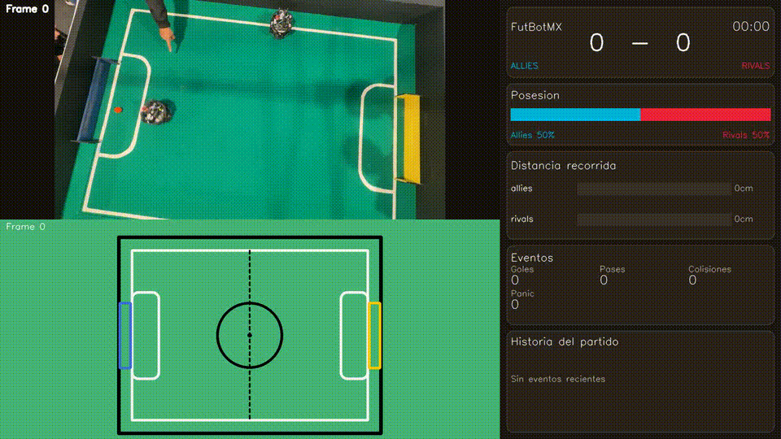

# FutBotMX Vision

Pipeline de vision por computadora para analizar partidos de futbol robotico de
la Copa FutBotMX. Usa SAM 3 para segmentación y agrega tracking temporal,
filtros geométricos, homografía, detección de eventos y una visualización
tactica del partido.

El sistema rastrea:

- robots con IDs estables: `A1`, `A2`, `R1`, `R2`;
- la pelota naranja;
- posesión por equipo, goles, colisiones, robots detenidos y distancia recorrida;
- un video final con frame original, mapa táctico y estadísticas del partido.

> Este proyecto no hace fine-tuning de SAM 3. Usa el modelo preentrenado
> `sam3.pt` y mejora la confiabilidad con postprocesamiento, recuperación local
> y validación temporal.

## Demo

Vista previa del tracking y dashboard final:



## Inicio Rápido

### 1. Clonar

```bash
git clone https://github.com/USER1012007/futbotmx.git
cd futbotmx
```

### 2. Crear Entorno

El proyecto esta pensado para correr con GPU NVIDIA y CUDA. Linux es el entorno
recomendado para procesar videos largos; Windows tambien funciona si tienes
drivers NVIDIA/CUDA correctos. En macOS se puede instalar para pruebas, pero la
inferencia sera mas lenta si corre en CPU.

#### Linux

```bash
conda env create -f environment.yml
conda activate futbotmx
```

Validar GPU:

```bash
python3 -c "import torch; print(torch.cuda.is_available()); print(torch.cuda.get_device_name(0))"
```

#### Windows

Usa Anaconda Prompt o PowerShell con Conda disponible:

```powershell
conda env create -f environment.yml
conda activate futbotmx
```

Validar GPU:

```powershell
python -c "import torch; print(torch.cuda.is_available()); print(torch.cuda.get_device_name(0))"
```

Si usas Windows nativo, ejecuta los comandos de Python manualmente. `run.sh`
requiere Git Bash, WSL o una terminal compatible con Bash.

#### macOS

`environment.yml` incluye `pytorch-cuda`, que no esta disponible en macOS. Para
pruebas locales, crea un entorno sin CUDA:

```bash
conda create -n futbotmx python=3.10 numpy opencv pytorch torchvision -c pytorch -c conda-forge
conda activate futbotmx
pip install supervision ultralytics trackers pytest
```

Ejecuta el pipeline con CPU:

```bash
python3 main.py --device cpu --video ruta/de_tu/video.mp4
```

### 3. Agregar Modelo y Video

Coloca los pesos de SAM 3 aqui:

```text
code/sam3.pt
```

### 4. Ejecutar Tracking

```bash
cd code
python3 main.py --video ruta/de_tu/video.mp4
```

Esto genera:

```text
data/tracking/tracking.jsonl
```

### 5. Renderizar Visualizacion

```bash
python3 tools/render_tracking_visualization.py \
  --video ruta/de_tu/video.mp4 \
  --tracking data/tracking/tracking.jsonl
```

El video de salida se escribe en:

```text
data/outputs/tracking_visualization/tracking_visualization.mp4
```

## Ejecución En Un Comando

Desde `code/`, ejecuta tracking y render en un solo paso:

```bash
bash run.sh --video ruta/de_tu/video.mp4
```

Para una prueba corta:

```bash
bash run.sh --video ruta/de_tu/video.mp4 --max-frames 300 --imgsz 640
```

### GPU / Tamaño De Imagen

Para una GPU pequeña:

```bash
python3 main.py --imgsz 512
```

Para una GPU más fuerte:

```bash
python3 main.py --imgsz 1280
```

Tambien puedes usar variables de entorno:

```bash
FUTBOT_SAM_DEVICE=cuda FUTBOT_SAM_IMGSZ=1280 python3 main.py
```

### Logs

```bash
python3 main.py > salida.log 2>&1
tail -f salida.log
```

## Requisitos

Entorno recomendado:

- Linux
- Python 3.10
- GPU NVIDIA con CUDA
- PyTorch con CUDA
- OpenCV
- Ultralytics
- Supervision
- Tracker compatible con ByteTrack

## Estructura Del Proyecto

```text
futbotmx/
├── code/
│   ├── main.py
│   ├── run.sh
│   ├── vision/          # segmentación, tracking, homografía, equipos
│   ├── analysis/        # eventos, estadísticas, lógica arbitral
│   ├── visualization/   # dashboard, mapa táctico, render final
│   ├── domain/          # entidades compartidas y modelo de cancha
│   ├── io_utils/        # lectura de video y tracking I/O
│   ├── tools/           # scripts de render y diagnostico
│   └── data/
│       ├── videos/
│       ├── tracking/
│       └── outputs/
├── docs/
├── environment.yml
├── LICENSE
├── CREDITOS_LICENCIAS.md
└── README.md
```

## Cómo Funciona

```text
Frame de video
  ├─ segmentación con SAM 3
  ├─ filtrado de robots y pelota
  ├─ asociación temporal con ByteTrack
  ├─ recuperación local por ROI cuando desaparecen objetos
  ├─ homografía a coordenadas de cancha
  ├─ IDs estables de equipo: A1/A2/R1/R2
  ├─ detección de eventos y estadísticas
  └─ render del dashboard
```

Componentes principales:

- `vision/segmentation.py`: inferencia con SAM 3, ByteTrack, recuperación de
  objetos y detecciones finales por frame.
- `vision/ball_utils.py`: filtros de pelota naranja, fallback HSV, rechazo de
  piel/manos, contexto de cancha y validación temporal.
- `vision/robot_utils.py`: compuertas temporales de robots y fallback para
  robots perdidos.
- `vision/team_assignment.py`: IDs estables y slots por equipo.
- `vision/homography.py`: proyección de pixeles a centímetros.
- `analysis/event_detector.py`: goles, pases, posesión, colisiones, fuera de
  cancha y robots detenidos.
- `analysis/stats_engine.py`: estadísticas del partido y métricas acumuladas.
- `visualization/`: mapa táctico y video final con dashboard.

## Archivos de Salida

```text
code/data/tracking/tracking.jsonl
code/data/outputs/tracking_visualization/tracking_visualization.mp4
code/salida.log
code/salida_tracking.log
```

`tracking.jsonl` guarda un objeto JSON por frame:

```json
{
  "frame_id": 123,
  "data": {
    "frame_id": 123,
    "timestamp_s": 4.1,
    "robots": [],
    "ball": null,
    "field_mask_present": true,
    "repositions": []
  }
}
```

Los IDs de robots se normalizan a:

```text
A1, A2, R1, R2
```

El `tracker_id` crudo viene de ByteTrack y no debe usarse como identidad final
del robot.

## Validación Antes De Corridas Largas

Antes de procesar un partido completo:

```bash
python3 main.py --video data/videos/my_match.mp4 --max-frames 300 --imgsz 640
python3 tools/render_tracking_visualization.py \
  --video data/videos/my_match.mp4 \
  --tracking data/tracking/tracking.jsonl \
  --max-frames 300
```

Revisa que:

- los robots visibles aparezcan como `A1/A2/R1/R2`;
- la pelota no salte a manos, porterías u objetos naranjas ajenos;
- las distancias se mantengan estables cuando los robots no se mueven;
- los goles solo ocurran cuando la pelota real cruza el área de gol.

## Limitaciones Conocidas

- Las oclusiones fuertes por manos pueden ocultar la pelota o los robots.
- La pelota puede desaparecer cuando sale de la cancha o queda totalmente
  cubierta.
- La calidad de la homografía depende de la visibilidad de la cancha y porterías.
- La asignación de equipos inicia por lado de cancha y después se bloquea por
  slots estables.
- La métrica de distancia ignora intencionalmente movimientos pequeños por jitter.

## Pruebas

Desde `code/`:

```bash
python3 -m py_compile main.py tools/render_tracking_visualization.py
pytest test
```

Para diagnostico:

```bash
python3 tools/diagnose_ball_tracking_video.py --help
python3 tools/diagnose_hsv_ball_candidates.py --help
```

## Entregables

- Pipeline funcional de tracking.
- `tracking.jsonl` con datos de robots y pelota por frame.
- Video final de visualización con dashboard.
- Documentacion open source en este README.
- Licencia y créditos de terceros en `LICENSE` y `CREDITOS_LICENCIAS.md`.
- Video demo: `TODO: agregar enlace final`.
- Reel de Instagram: `TODO: agregar enlace publico`.

## Créditos

Este proyecto usa o integra:

- SAM 3 / Segment Anything Model 3, Meta AI.
- Ultralytics SAM predictor.
- Roboflow Supervision.
- OpenCV.
- PyTorch.
- ByteTrack o tracker temporal compatible.
- Videos de Copa FutBotMX / Federacion Mexicana de Robotica, sujetos a los
  permisos otorgados por los organizadores.

Consulta `CREDITOS_LICENCIAS.md` para notas de licencia y atribucion de terceros.

## Licencia

El codigo del proyecto se distribuye bajo la licencia incluida en `LICENSE`.

Los pesos de modelos, videos y dependencias de terceros conservan sus propias
licencias. Revisa la licencia oficial de SAM 3 antes de redistribuir
`code/sam3.pt`.
